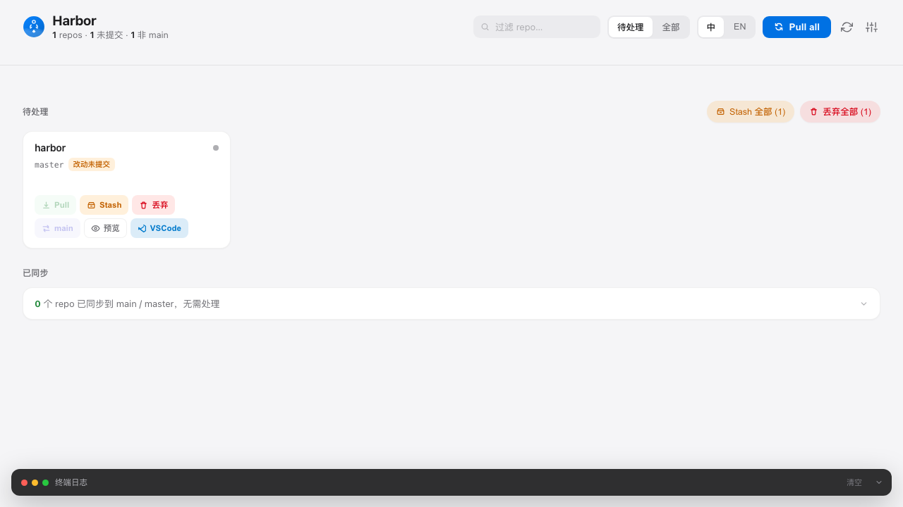

# Harbor

<p align="center">
  
</p>

A local web dashboard for managing multiple git repositories at once.

**Zero dependencies** — Python standard library + a single HTML file. No Node.js, no pip packages, no Docker.

<p align="center">
  
</p>

## Why Harbor?

You know the feeling: you've got 20+ git repositories scattered across your laptop — work projects, side projects, open source stuff you cloned to read the code… and every Monday morning you're doing the same dance:

> 🧐 *"Did I push that branch on Friday?"*
> 😅 *"Oh right, this repo is 3 weeks behind."*
> 😤 *"Why did I have uncommitted changes here?"*

Harbor was built for that. It's a little dashboard that shows **all your repos at a glance** — clean, dirty, ahead, behind — and lets you pull, stash, and switch branches in bulk. No more cd-ing around 15 directories before you can start your day.

It's also intentionally simple: one Python file + one HTML file. No build step, no database, no Docker. You install it in 2 seconds and forget about it.

## Features

- **Multi-repo overview** — see every repo's branch, dirty/clean state, and ahead/behind count at a glance
- **Batch Pull** — `git pull --ff-only` across all repos concurrently with real-time SSE progress
- **Stash / Discard / Checkout main** — common operations on individual repos or in bulk
- **Diff preview** — view uncommitted changes before discarding
- **Dark mode** — follows your system preference automatically
- **i18n** — Chinese and English
- **VS Code integration** — open any repo in VS Code with one click
- **Safe** — binds to `127.0.0.1` only; dangerous operations require confirmation

## Quick Start

```bash
# Install
pip install harbor

# Run — scan the current directory
harbor

# Or scan a specific directory
harbor ~/projects

# Or scan multiple directories
harbor ~/work ~/personal ~/oss
```

Open [http://127.0.0.1:8765](http://127.0.0.1:8765) — or let Harbor open it for you.

### From source

```bash
git clone https://github.com/ginkgohat/harbor.git
cd harbor

# Option A: pip install in dev mode
pip install -e .
harbor ~/projects

# Option B: run directly (no install needed)
make run
# or: PYTHONPATH=src python3 -m harbor ~/projects
```

### Makefile

```
make run      # Run Harbor (current directory)
make test     # Run tests
make lint     # Run lint checks
make dev      # Install in development mode
make clean    # Remove build artifacts
```

## Configuration

Settings are resolved in priority order: **CLI flag > environment variable > config file > default**.

| CLI flag | Env var | Config key | Default |
|---|---|---|---|
| `--port` | `HARBOR_PORT` | `port` | `8765` |
| `--min-depth` | `HARBOR_MIN_DEPTH` | `min_depth` | `1` |
| `--max-depth` | `HARBOR_MAX_DEPTH` | `max_depth` | `5` |
| `--config` | `HARBOR_CONFIG` | — | `~/.config/harbor/config.toml` |
| `--no-browser` | — | — | opens browser |

The config file is TOML. Scan roots are stored as an array of tables:

```toml
port = 8765
min_depth = 1
max_depth = 5

[[roots]]
path = "/Users/you/work"
label = "work"

[[roots]]
path = "/Users/you/oss"
label = "oss"
```

Roots passed on the command line (`harbor ~/work ~/oss`) are persisted into
the config file on startup, so Rescan and later runs keep using them. Roots
can also be added/removed from the Settings panel in the UI.

## Security model

Harbor binds to `127.0.0.1` only and has **no authentication** — anyone with
local access to your machine can reach it. Protection against malicious web
pages relies on two layers: the browser's same-origin policy, and a
server-side Origin/Referer check on `POST /api/repo/<path>/action` that
rejects cross-origin requests with `403`. Destructive operations (discard,
checkout) additionally require an in-UI confirmation. Do not port-forward or
reverse-proxy Harbor to an untrusted network.

## How it works

Harbor scans the given root directory for `.git` subdirectories using `os.walk` (cross-platform). For each repo it runs `git` commands to determine status, then serves the results as a JSON API. The frontend is a single-page HTML file that talks to this API, with SSE for real-time pull progress.

For architecture details and project structure, see [CONTRIBUTING.md](CONTRIBUTING.md#project-structure).

## Similar tools

- [ungit](https://github.com/FredrikNoren/ungit) — web-based Git GUI (single repo focus)
- [gita](https://github.com/nosarthur/gita) — CLI multi-repo status panel
- [myrepos](https://myrepos.branchable.com/) — CLI batch operations across repos

Harbor's niche: **web UI + batch operations + zero dependencies**.

## License

MIT